<div align="center">

# 🛰️ Your Bot, Our Navigation

### Vision-only autonomous navigation for an outdoor UGV · SIH 2026 · PS 26126

**One camera in → a metric traversability costmap → a safe `(v, ω)` drive command out.**
No GPS. No LiDAR. The camera's height, pitch and roll are *measured every frame*, not configured.


**Team AIT_WINTERBREAKERS** · Team ID 136814 · Theme: Smart Automation

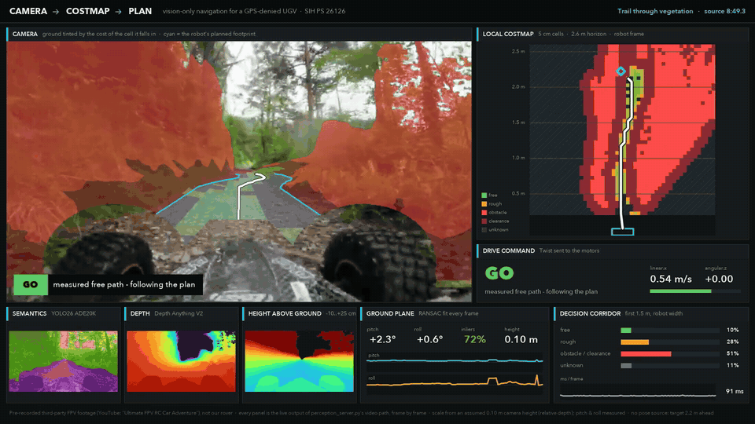

*Real off-road footage, processed frame by frame by our unmodified server code. The ground is tinted by the cost of the cell it falls in; the cyan ribbon is the robot's planned footprint.*

### ▶ [Watch the 86-second demo](docs/media/demo_720p.mp4)

</div>

---

## ✨ What it does

| The problem statement asks for… | What we built | Where |
|---|---|---|
| **1. Path detection**: safe paths vs. rocks, ditches, trees | Depth + semantics + a ground plane fitted **every frame** → 5–10 cm costmap. Ditches it cannot see into become obstacles; unmeasured ground is **never** free | [`perception_core.py`](perception_core.py) |
| **2. Visual localisation** without GPS | Ground-plane visual odometry: a bird's-eye warp through the fitted plane gives motion **in metres**, no scale drift from the mono camera | [`ground_vo.py`](ground_vo.py) |
| **3. Collision avoidance** toward a destination | Global costmap with memory, A\* / D\* Lite route, local A\* + pure pursuit replanned every frame, explicit BLOCKED / LOST / recovery states | [`navstack.py`](navstack.py), [`dstar_lite.py`](dstar_lite.py) |
| Wheel / motor commands | `(v, ω)` as a ROS `Twist`, plus `OccupancyGrid`, `Odometry`, `Path`, all JSON over WebSocket (rosbridge-ready) | [`ros_msgs.py`](ros_msgs.py) |

<table>
<tr>
<td width="50%">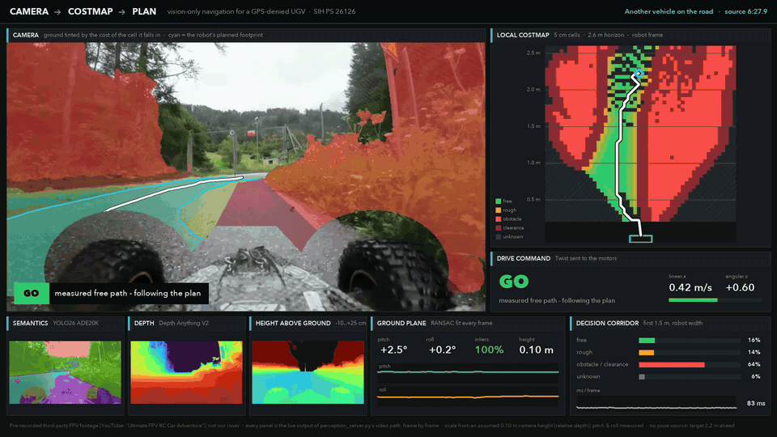<br><b>Another vehicle on the road:</b> the plan bends, slows or crawls, then resumes when the ground ahead is measured free again.</td>
<td width="50%">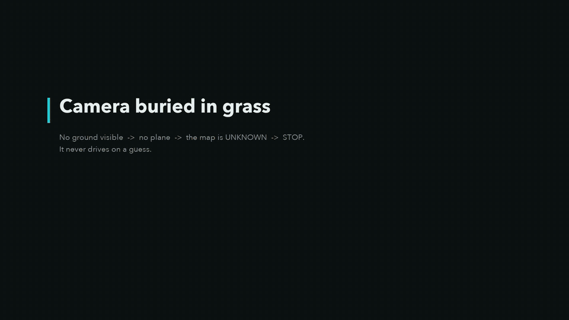<br><b>Camera buried in grass:</b> no visible ground → no plane → the map is UNKNOWN → <b>STOP</b>. It never drives on a guess.</td>
</tr>
</table>

### 🎮 Closed loop in the 3D simulation

<div align="center">
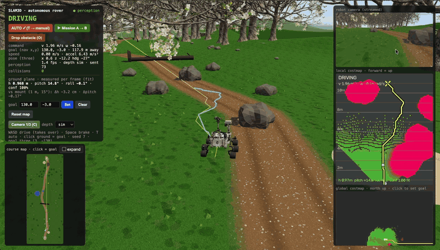
</div>

*The rover drives itself from A to B on a 130 m course (React Three Fiber + Rapier physics), streaming its camera to the same perception server and driving on the `(v, ω)` it gets back. Boulders and the fallen tree appear as lethal blobs in the local costmap (right), and the plan bends around them. Top left, the camera pose is **measured** from the ground plane (h 1.010 m, pitch 15.4°) next to the true mount (1 m, 15°), with the collision count checked against ground truth.*

## 🖼️ The pipeline, stage by stage

<table>
<tr>
<td width="33%">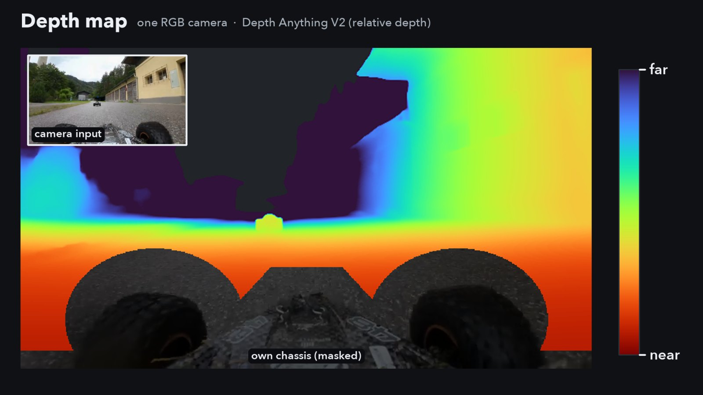<br><b>1 · Depth</b>: Depth Anything V2 on one RGB camera (stereo drops into the same interface).</td>
<td width="33%">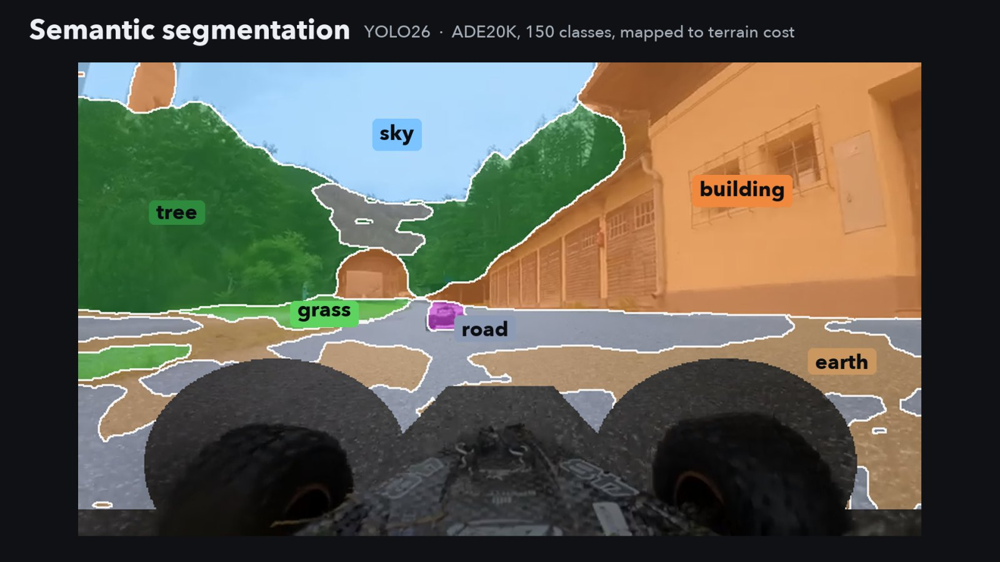<br><b>2 · Semantics</b>: YOLO26 · ADE20K, 150 classes mapped to terrain cost. Geometry can veto a wrong label.</td>
<td width="33%">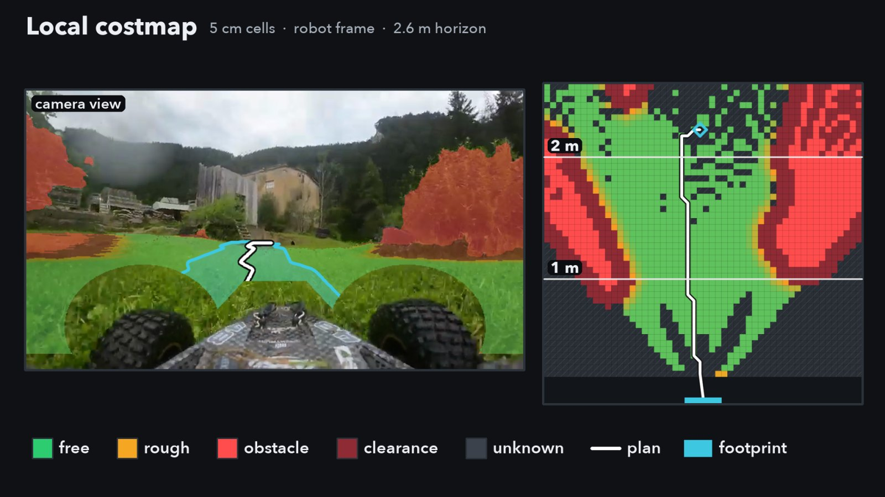<br><b>3 · Local costmap</b>: free / rough / obstacle / clearance / unknown in the robot frame, with the plan and footprint.</td>
</tr>
<tr>
<td width="33%">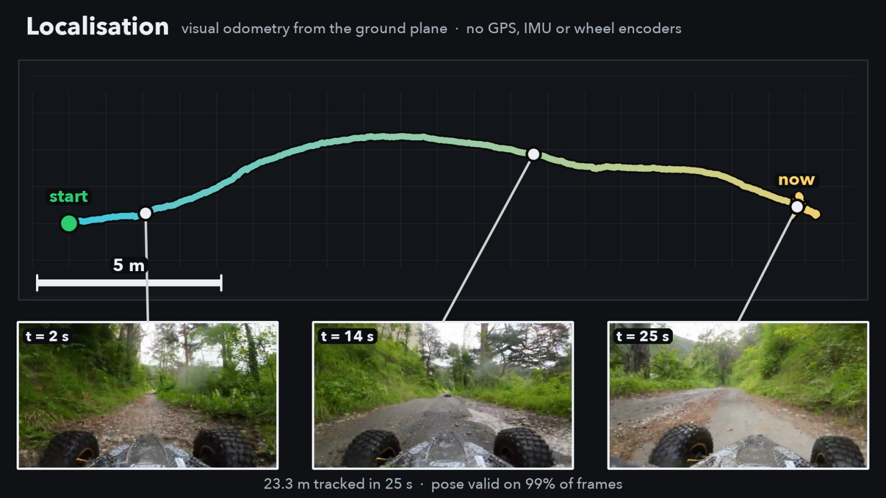<br><b>4 · Localisation</b>: ground-plane visual odometry, 23 m of forest trail tracked with the pose valid on 99% of frames.</td>
<td width="33%">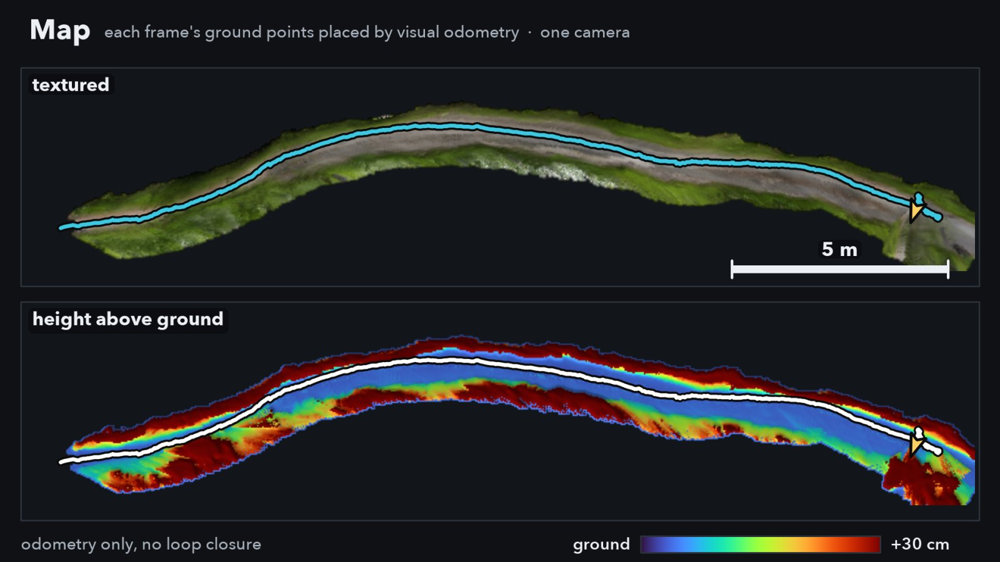<br><b>5 · Map</b>: every frame's ground points placed by the VO pose, textured and as height above ground.</td>
<td width="33%">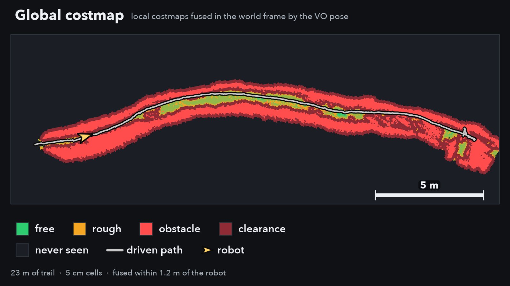<br><b>6 · Global costmap</b>: local maps fused in the world frame; one noisy frame cannot wall off the trail.</td>
</tr>
</table>

## 📏 Measured, not claimed

| | Result |
|---|---|
| **Real rover** (Raspberry Pi 4B + one Pi camera → laptop over Wi-Fi) | **~107 ms** camera → command, **10–12 fps**. The Pi captures at 30.7 fps, so the link is the limit, not the camera |
| **17 min of real off-road FPV footage** (3,100 frames: grass, dirt trail, asphalt, gravel, culvert, weeds) | Ground plane fitted on **94%** of frames |
| **Visual odometry**, 23 m forest trail, full frame rate | Pose valid on **99%** of frames, no GPS / IMU / encoders |
| **Driving on a path it cannot see**, same 17 min | **2,620 frames → 0** after our safety fixes (and 930 → 0 on a lost / impossible ground estimate) |
| **Automated checks** (no GPU, no camera needed) | **185 passing**: geometry, costmap rules, planners, state machine, rover link |
| **3D simulation** | 130 m A → B course: boulders, fallen tree, ditch, pond, a person walking across; scored against ground truth |

## 🧠 How it thinks

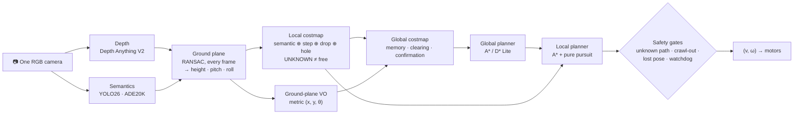

**Safety rules that are load-bearing** (each one has a regression test):

- **Unknown is never free.** A path ahead that is ≥ 30% unknown → half speed; ≥ 60% → STOP.
- **Ditches are obstacles.** A gap in the data with measured ground on both sides is a trench the camera cannot see into.
- **Geometry vetoes semantics.** A "wall" label on ground measured flat is expensive, not blocked; water is always lethal.
- **Clearance means out, slowly.** Inside an obstacle's clearance the robot may only move away from it, at ≤ 0.15 m/s.
- **Impossible geometry is not trusted.** A fitted camera height outside the rig's range makes the map UNKNOWN.
- **One speck is not a wall.** The global memory needs 3 sightings before a cell blocks the route; the live map still reacts on the first.
- **Own body masked** (`--ego-mask`): the chassis and wheels in view are ignored, and ground hidden behind them is *occluded*, not a hole.

## 🚦 Status: honest

| ✅ Built and running | 🔜 Next |
|---|---|
| Perception, costmap, VO, global + local planning, safety gates | Close the ESC/PWM motor loop on the rover (commands already reach the Pi) |
| Sim, webcam, real Pi rover, recorded video, all in one server | Onboard compute (Jetson Orin) |
| Nav2-shaped messages, flight recorder, live dashboard | Stereo depth + ORB-SLAM3 loop closure for long routes |
| 185 automated checks | ROS 2 Nav2 nodes; public off-road datasets |

> **Footage credit:** the demo GIFs and video are derived from a third-party FPV RC-car video on YouTube ("Ultimate FPV RC Car Adventure: Surprising Range & Control"), used here as a stand-in test track for research and educational demonstration. It is not our rover. Rights remain with the original creator; we will remove it on request. On that footage, scale comes from an assumed 0.10 m camera height (relative depth); pitch and roll are still measured.

---

## 🔧 Technical documentation

> **New here?** Read [EXPLAINED.md](EXPLAINED.md): the whole pipeline, every equation, in plain language.

## Contents

1. [What you get](#1-what-you-get)
2. [Quick start](#2-quick-start)
3. [How it works](#3-how-it-works)
4. [The 3D simulation demo](#4-the-3d-simulation-demo)
5. [Webcam mode](#5-webcam-mode)
6. [Rover mode](#6-rover-mode)
7. [Nav2 compatibility](#7-nav2-compatibility)
8. [Configuration](#8-configuration)
9. [Tests](#9-tests)
10. [Performance](#10-performance)
11. [File overview](#11-file-overview)
12. [Known limitations](#12-known-limitations)
13. [Legacy prototype](#13-legacy-prototype)

---

## 1. What you get

| Piece | File | What it does |
|---|---|---|
| **Self-calibrating perception** | `perception_core.py` | Metric depth + semantic segmentation → per-frame ground plane (camera **height, pitch, roll are measured, not configured**) → 10 cm cost grid |
| **Nav2-style planning** | `navstack.py`, `dstar_lite.py` | Global costmap with memory (raw obstacles, free-space clearing), global A\* or incremental **D\* Lite**, carrot hand-off, local A\* + pure pursuit, turn-in-place / blocked recovery, `LOST` stop, watchdog |
| **Visual odometry** | `ground_vo.py` | Metric odometry from the ground plane: bird's-eye warp through the fitted plane, keyframe registration → `(dx, dy, dθ)`; the rover's pose source |
| **Server** | `perception_server.py` | One process for every mode: sim frames over WebSocket, webcam, video, or a rover pushing frames over WebSocket. Broadcasts costmaps, plans and commands as JSON |
| **Dashboard** | `dashboard/index.html` | Camera + semantics, depth, local costmap, global map, plane estimate, goal input |
| **3D rover sim** | `sim3d/` (from [SLAM3D](https://github.com/Klick07/SLAM3D)) | React Three Fiber + Rapier rover on a 130 m outdoor A → B course (boulders, fallen tree, ditch, pond, a walking person, woodland); streams its camera (RGB + true depth), drives on the returned commands, scores itself against ground truth |
| **Rover streamer** | `rover_agent.py` | Runs on the Raspberry Pi: captures from the camera (ground-metered, slew-limited auto-exposure), JPEG-encodes, and pushes frames to `perception_server.py` over WebSocket. Perception, planning and depth all run on the Mac; the Pi does not yet turn `cmd_vel` into motor PWM |
| **ROS shapes** | `ros_msgs.py` | `OccupancyGrid`, `Odometry`, `Path`, `Twist` as JSON, ready for rosbridge |

---

## 2. Quick start

```bash
# one-time
./setup_mac.sh                      # venv + pip install (Apple Silicon: MPS)
# the rover sim is in ./sim3d ; copy rover.glb tree.glb into sim3d/public/
# (Sketchfab assets, not in git)

# 3D demo: perception server + rover sim, opens the browser
./run_sim.sh                        # ground-truth depth from the renderer
./run_sim.sh --depth metric         # neural depth instead

# webcam: laptop on the ground, dashboard in the browser
./run_webcam.sh

# stop everything (servers, sim, ports)
./stop_all.sh
```

Real rover, over Wi-Fi (see [§6](#6-rover-mode) for what these flags mean):

```bash
# on the Mac: the perception server, indoors depth model
python perception_server.py --source rover --depth metric-indoor --depth-res 280 --profile --port 8790
```

```bash
# on the Pi: streams the camera to the Mac (--rotation if it's bolted on its side)
python3 rover_agent.py --server ws://<mac-ip>:8790/ws --fps 12 --rotation 90
```

Then, in the sim: press **▶ Mission A → B** in the HUD (the demo run: goal at pad B,
AUTO on), or press **T** for AUTO and click any destination on the ground, the course
map (bottom-left) or the global map. Press **O** mid-run to drop a crate in front of the
rover. The HUD shows status, the measured camera pose, ground-truth collisions and both
maps.

Requires macOS with a display for the webcam and the sim; the tests need neither.

---

## 3. How it works

```
frame (RGB [+ true depth from the sim])
  │
  ├─ depth       Depth Anything V2 Metric-Outdoor/-Indoor (metres) | relative + nominal height |
  │              affine (disparity; needs an external orientation constraint, §12) | sim
  ├─ semantics   YOLO26 ADE20K (150 classes) → per-pixel cost via keyword table
  │
  ▼  perception_core.py
  undistort      rectify the lens once, up front (camera/video/rover rigs; a no-op with no coeffs)
  back-project to the OPTICAL frame
  RANSAC ground plane on ground-labelled pixels, near field first, fixed inlier gate
      → camera height, pitch, roll   (measured every frame; --height/--pitch are optional LOCKS)
  rotate every point into a GROUND-ALIGNED robot frame (Z = height above ground)
  cost(cell) = max( semantic vote , positive obstacle , negative obstacle , hole )
  UNKNOWN never free · returned RAW and INFLATED by the robot radius
  │
  ├─ ground_vo.py      (rover) bird's-eye warp through the fitted plane, register against a
  │                    keyframe → (dx, dy, dθ) in metres → VisualOdomPose (sim: true pose)
  ▼  navstack.py
  GlobalCostmap.fuse   world frame, RAW obstacles (inflation is applied at plan time),
                       max-fusion; optional clearing of cells re-observed free
  plan_global          A* (or D* Lite, kept and repaired between plans) on a coarse,
                       inflated, boxed copy ≤ 1 Hz → world path
  carrot               first path point ~10 m ahead → local goal
  local A* + pure pursuit on the frame grid backfilled from memory, then inflated → (v, ω)
  Navigator            NO_GOAL / PLANNING / TURNING / DRIVING / BLOCKED / LOST / ARRIVED
```

### Why the geometry is self-calibrating

The first prototype trusted a hand-measured camera height and pitch and pinned the
ground to Z = 0 from those constants. On a laptop, a hand-held phone or a rover with
suspension those values are neither known nor constant, roll is never zero, and every
height threshold is then measured against the wrong datum — the webcam costmap did not
match the floor in front of it. Now the plane is fitted per frame; on synthetic scenes
it recovers unknown rigs to within 1 cm and 0.5°, and a 6° roll that used to produce
72 false lethal cells produces none. The sim's mounted camera (1.0 m, 15°) doubles as a
live accuracy check: the HUD shows the estimate against the mount.

### The cost rules (all conservative, all tested)

| Channel | Rule | Catches |
|---|---|---|
| Semantic vote | ≥ 25 % of a cell's points carry a lethal label → LETHAL; otherwise mean of the non-lethal points | water, walls, trees, people, vehicles |
| Tall-label check | a label that implies height (wall, tree, car…) on a cell the geometry measured **flat** is demoted to cost 150, never lethal; water stays lethal | mislabelled ground (a grey floor read as "wall") |
| Positive obstacle | enough points above 0.25 m over the fitted ground | rocks, logs, fences, bushes |
| Negative obstacle | enough points below −0.20 m within 9 m | kerb drops, trench walls |
| **Hole rule** | a run of cells with **no measurement at all**, with measured ground before **and** beyond it along the view, is a depression → LETHAL (ignores shadows of positive obstacles and honest sampling gaps) | trenches whose floor is hidden by their own lip |
| Evidence floors | < 3 points → UNKNOWN; geometry needs ≥ 2 agreeing points and ≥ 20 % of the cell | depth speckle |
| Fusion | `max` of everything; UNKNOWN is expensive for the planner but passable | the safety argument |

### What the navigator will not do (all tested in `test_nav.py`)

| Rule | Why it exists |
|---|---|
| The local planner never puts the robot's **centre** inside the inflation skirt (253) — it is a collision, not a squeeze. A robot already inside one may leave it, never go deeper | the old "passable at high cost" skirt is how the sim rover drove into a trench whose edge was marked correctly |
| A goal inside a hazard's clearance → stop at the closest safe point, `ARRIVED` with a note | a goal clicked beside a ditch otherwise pulls the robot to the lip |
| No safe step (lethal ahead, a one-cell plan, or a plan ending inside `stop_dist`) → `BLOCKED` → spin recovery, never "DRIVING at 0 m/s" | three paths used to freeze the rover forever while it reported driving |
| A global map but no pose (odometry lost) → `LOST`, stop | the world-frame goal used to be read as robot-relative, i.e. the wrong way |
| Memory stores raw obstacles; every noisy detection's skirt is not remembered forever | fusing inflated grids grew a rock's footprint from 39 to 548 cells in 30 frames |

---

## 4. The 3D simulation demo

`sim3d/` (React Three Fiber + Rapier; upstream: [Klick07/SLAM3D](https://github.com/Klick07/SLAM3D)). The rover carries a camera at 1.0 m, pitched
15° down, 60° vertical FOV. Each capture (≤ 6 Hz, one frame in flight):

1. renders the scene from the rover's camera into an offscreen target (linear → sRGB
   corrected) → 640×360 JPEG;
2. renders a depth pass (`MeshDepthMaterial`, RGBA packing) → unpacked and linearised
   on the CPU → 320×180 u16 millimetres (the stand-in for a stereo camera);
3. packs header (intrinsics, pose, mode) + JPEG + depth into one binary WebSocket frame.

The server answers with `(v, ω)`; the rover applies each command for one control
period, then holds heading until the next (this is what removed the zig-zag).

**Course** (`src/nav/world.js`): a 130 m dirt trail from pad **A** to pad **B** through
open meadow, one challenge per zone, every detour sized for the robot (the server
inflates obstacles by a 1 m radius; the tightest zone still leaves 8.75 m of free width,
checked by rasterising the ground truth):

| d (m) | zone | exercises |
|---|---|---|
| 14–32 | boulder field | positive obstacles (height) |
| 42 | fallen tree across the trail | positive obstacle, detour |
| 56 | washed-out drainage ditch, 0.6 m deep | negative obstacle (depth only), go round its end |
| 68–80 | pond beside the trail, puddle on it | water in a real depression: depth **and** semantics |
| 90 | a person walking across the trail | dynamic obstacle |
| 100–116 | woodland: trunks and bushes near the trail | clutter |
| 120 | mud across the trail | drivable but costly (semantics) |

The terrain is a Rapier heightfield (ditch and ponds are real depressions the rover can
fall into); hills rise beyond ~24 m from the trail, past the 20 m depth horizon. Every
hazard is scored by a ground-truth contact counter the perception never sees; the goal
flag and path lines are drawn on a layer the robot camera does not render.

**Controls**: **▶ Mission A → B** (sets the goal at B and switches to AUTO), **Drop
obstacle / O** (a crate appears 6 m ahead: the "sudden obstacle" test), WASD drive
(takes over from AUTO), Space brake, **T** AUTO/MANUAL, **C** camera (chase / top /
driver), click ground or maps to set a goal, X,Y box in the HUD.

**Flight recorder**: the server keeps the last 300 frames of what the local planner saw
(planning grid after memory backfill, pose, carrot, path, command, AUTO/MANUAL) and writes
them to `logs/flight_*.pkl.gz` whenever the sim reports a ground-truth contact, or on
`GET /debug/dump`.

Measured (seed 7, `--depth sim`, A\*): A → B in 85 s, 0 contacts, no intervention.

**Frames**: nav world X = −three.z, Y = −three.x, θ = heading (CCW positive), converted
in exactly one place (`src/nav/frames.js`). Protocol in [PROTOCOL.md](PROTOCOL.md).

---

## 5. Webcam mode

```bash
./run_webcam.sh                 # = perception_server.py --source 0 --rig macbook --depth metric
```

Put the laptop on the ground, lid at about 90°. The dashboard shows the measured
camera height (expect ≈ 0.20–0.23 m), pitch and roll, and their confidence; tilt the
lid and watch them track while the map stays put. There is no pose source, so there
is no global map: goals are in the robot frame (click the local costmap) and the
command shown is what would be sent to a base.

Turn off Center Stage / auto-framing (it changes the focal length). The default
intrinsics assume a 78° horizontal FOV; pass `--hfov` or run `calibrate.py` for exact
values.

---

## 6. Rover mode

```bash
python perception_server.py --source rover --depth metric-indoor --depth-res 280 --profile --port 8790
```

```bash
python3 rover_agent.py --server ws://<mac-ip>:8790/ws --fps 12 --rotation 90
```

**Hardware assumed.** A Raspberry Pi 4B (4 GB) with a Raspberry Pi Camera Module v2
(IMX219, rolling shutter, fixed focus — there is no autofocus to lock), on a rigid
skid/tank-steered chassis with no suspension and no wheel encoders. `rover_agent.py`
runs on the Pi and does one job: capture, JPEG-encode, and push frames to
`perception_server.py` on the Mac over WebSocket, in the binary layout `PROTOCOL.md`
section 2 defines. Everything else — depth, semantics, the costmap, planning — runs
on the Mac, same as every other source, via the `pushes_frames` / `has_true_depth` /
`has_pose` / `is_vehicle` capability flags `PerceptionServer.__init__` sets once per
source. `cmd_vel` comes back over the same socket, but nothing on the Pi turns it
into motor PWM yet: `apply_cmd()` in `rover_agent.py` is an explicit stub, so this is
today a perception-and-planning bench, not yet a closed driving loop.

**Measured intrinsics.** At 640×480, taken from the sensor's FULL-FOV 1640×1232 mode
(62.2° × 48.8° optics): `fx = fy = 530.5`, `cx = 320`, `cy = 240` — the defaults baked
into both `rover_cfg()` and `rover_agent.py`'s own `--fx/--fy/--cx/--cy`.

**The IMX219 sensor-mode trap.** `Picamera2.sensor_modes` lists several crop windows
under the same output size, and they are not all full-frame:

```
(640, 480)    crop=(1000, 752, 1280,  960)   <- only 39% of sensor width, hfov ~26.5 deg
(1640, 1232)  crop=(   0,   0, 3280, 2464)   <- FULL FOV, 62.2 deg  ** REQUIRED **
(1920, 1080)  crop=( 680, 692, 1920, 1080)   <- 58% of sensor width
```

Naively requesting a 640×480 *sensor* mode silently selects the cropped one: the
field of view collapses to ~26.5° (±0.59 m of lateral view at 2.5 m instead of the
full width), the costmap still looks plausible, and nothing raises an error. Always
configure the camera with `sensor={"output_size": (1640, 1232)}` and let software
downscale to the output size, never the other way around.

**Why the sensing envelope is 2.6 m, not 8 m.** Ground sample spacing grows as
`stride * r² / (fy * h)` — the same expression the hole rule already uses to decide
how far it can trust a gap in the depth. At this rig's mount height (`h ≈ 0.17 m`)
and `fy ≈ 530`, that spacing is 1.1 cm at 1 m, 4.4 cm at 2 m, 18 cm at 4 m, and 68 cm
at 8 m: past about 3 m, the entire remaining range to 8 m lands in roughly a dozen
pixel rows, where one pixel of depth error is a quarter-metre of range. An 8 m map at
this mount height is not a sparse map, it is a fictional one. `rover_cfg()` therefore
caps the grid at `x_max = 2.60 m`, sized with margin: at 0.5 m/s with ~150 ms of link
latency the rover comes to rest well inside that horizon, and the hole rule's own
range cutoff computes to 3.68 m — comfortably past the 2.6 m the grid actually
extends to. The grid stays 4:3, not 16:9: the binding constraint is how many ground
*rows* the sensor gets, and vertical FOV is what buys them, so cropping to 16:9 would
throw away a third of that for nothing.

**`--rotation`.** If the camera ends up mounted on its side, `rover_agent.py
--rotation {0,90,180,270}` rotates the frame upright before sending it *and*
transforms the intrinsics to match (a 90°/270° turn swaps `fx`/`fy` and moves the
principal point — sending the unrotated intrinsics with a rotated image would
silently rescale every distance in the costmap). It works, but remounting the camera
upright is strictly better: software rotation narrows the usable horizontal FOV to
48.8°.

**Pose: ground-plane visual odometry.** `ground_vo.py` warps the ground through the
plane fitted this frame into a metric top-down image (5 mm pixels), tracks it against a
keyframe (new keyframe every 15 cm or 8°) and reads `(dx, dy, dθ)` straight off a rigid
fit — the scale comes from the camera height the plane already measured, so there is no
monocular scale ambiguity. Features are kept away from the edge of the camera's view (a
fixed edge in the warp votes for "no motion") and matches must actually look alike
(patch NCC), so a featureless floor reports "lost" instead of a confident standstill.
`navstack.VisualOdomPose` integrates the steps with exact SE(2) composition; after 8
failed frames the pose is withheld and the Navigator stops with `LOST`. On rendered
ground (`test_rover.py`): 0.05 cm over 3 m straight, 1.1 cm over a 3 m arc, 0.03 mm
after 20 s standing still. No figure from a real traverse yet.

**Camera exposure.** `rover_agent.py --ae ground` (default) runs a slow software
auto-exposure metered on the lower, ground part of the image: at most 15 % per 0.5 s, a
dead band, and an 8 ms shutter cap (gain makes up the rest — rolling shutter smears on a
rigid chassis). A one-off lock at start-up (`--ae locked`, the old behaviour) is fine on
a bench and fails the first time the rover drives into shade.

**Which depth model.** Use `--depth metric` outdoors and `--depth metric-indoor` for
bench testing — the outdoor-trained model reads a ~2 m indoor wall as 5–9 m away,
leaving only a small fraction of pixels inside `max_depth`. Both are metric, so
`rover_cfg()`'s `nominal_height` and thresholds apply unchanged either way. `relative`
and `affine` exist for a rig with no metric model available, but see
[§12](#12-known-limitations) before reaching for `affine` — it is not usable
standalone yet.

---

## 7. Nav2 compatibility

ROS 2 is not required. The stack mirrors Nav2's layout (global costmap + planner,
local costmap + controller, recovery behaviours) and emits Nav2-shaped messages:

| HTTP | Message |
|---|---|
| `GET /ros/occupancy_grid` | `nav_msgs/OccupancyGrid`, local grid, frame `base_link` |
| `GET /ros/global_grid` | `nav_msgs/OccupancyGrid`, world grid, frame `map` |
| `GET /ros/odometry` | `nav_msgs/Odometry` |
| `GET /ros/path` | `nav_msgs/Path` |
| `GET /ros/cmd_vel` | `geometry_msgs/Twist` |

These are exactly what a rosbridge publisher would send; swapping in real Nav2 later
means publishing them and reading `cmd_vel` back. The pose enters through
`navstack.PoseSource` — ground truth in the sim, ground-plane visual odometry on the
rover, and later the team's visual SLAM.

---

## 8. Configuration

`perception_server.py --help` lists everything. The important ones:

| Flag | Default | Meaning |
|---|---|---|
| `--source` | `0` | `sim`, `rover` (the Pi pushes frames), camera index, or video path |
| `--depth` | `metric` | `metric` (Depth Anything V2 metric-outdoor), `metric-indoor` (same family, indoor-trained), `relative` (1/disp + `--nominal-height`), `affine` (solves both affine unknowns from ground planarity — needs an external orientation constraint, not usable standalone, see [§12](#12-known-limitations)), `sim` (renderer depth) |
| `--rig` / `--hfov` | `macbook` / 78° | intrinsics for camera/video sources; the sim and rover derive or send exact intrinsics |
| `--dist` | none | lens distortion `k1,k2,p1,p2,k3` for camera/video rigs, rectified once up front; the rover sends its own per frame |
| `--height --pitch --roll` | estimate | **lock** the camera pose instead of measuring it |
| `--nominal-height` | `None` → 0.60 m (camera/video), 0.17 m (`--source rover`) | camera height used to scale `relative`/`affine` depth; the one ruler measurement that gives the map its metric scale |
| `--ego-mask` | none | PNG, white = the vehicle's own body in frame. Ignored by the plane fit, costmap and VO; ground hidden behind it is occluded, not a hole |
| `--plausible-height` | nominal/3 – nominal×3 when a nominal height is known (rover, or `--nominal-height` given); never in the sim | `lo,hi` metres. A fitted camera height outside it is not ground (metric depth reads a 10 cm FPV camera as ~2.5 m up), so the map is reported UNKNOWN instead of built on it |
| `--v-max --w-max --robot-radius` | 2.0 / 0.8 / 1.0 (sim), 0.5 / 1.0 / 0.20 (rover) | controller limits and inflation |
| `--global-planner` | `auto` → `dstar` (rover), `astar` (else) | global planner; D\* Lite gives the same path cost as A\* and replans ~5x faster when the map changes a little at a time |
| `--port` | 8790 | dashboard + WebSocket |
| `--profile` | off | per-stage milliseconds |

`rover_agent.py`: `--server`, `--fps`, `--rotation`, intrinsics `--fx --fy --cx --cy --dist`,
`--ae ground|locked`.

Live tunables (dashboard or `set_param`): `obstacle_h`, `ditch_h`, `robot_radius`,
`sem_lethal_frac`, `min_cell_pts`, `plane_gate`, `plane_near_range`, `max_depth`.
Grid: sim 0.5–12 m × ±5 m (0.1 m cells); webcam 0.3–8 m × ±4 m (0.1 m cells);
rover 0.20–2.60 m × ±1.30 m (0.05 m cells — a 0.25 m chassis needs a finer grid than
the sim or a webcam get away with).

**Unknown-path gate (camera, video, rover; off in the sim).** UNKNOWN stays passable for
the planner, so a frame whose map came out empty used to produce a full-speed plan
straight through it. Now the first 1.5 m of the chosen path is checked: ≥ 30 % UNKNOWN →
half speed (`note: slow: path ahead N% unknown`), ≥ 60 % → `BLOCKED`
(`NavCfg.unknown_gate*`).

---

## 9. Tests

No models, no camera, no GPU; a few seconds each.

```bash
source .venv/bin/activate
python test_perception_core.py   # 59 checks: plane recovery, roll, step-down, trench, tall labels, hold, locks…
python test_nav.py               # 68 checks: fusion, clearing, global A* and D* Lite, carrot, memory, state machine
                                 #   (LOST, no silent standstill, goal beside a trench), ROS shapes
python test_rover.py             # 16 checks: ground VO drift on rendered ground, failure reporting, Pi auto-exposure
python test_geometry.py          # 42 checks: legacy prototype, still green
python sim.py --validate         # legacy analytic simulator
```

---

## 10. Performance (Apple M4, MPS; rover over a 2.4 GHz Wi-Fi hotspot)

| Mode | depth | sem | core | nav | render | rate |
|---|---|---|---|---|---|---|
| sim, `--depth sim` (640×360) | 0.5 ms | 35–80 ms | ~20 ms | 1–10 ms (global replan ~80 ms at ≤ 1 Hz) | 35–55 ms | 4–6 Hz |
| video/webcam, `--depth metric` (1280×720) | 85–110 ms | 60–140 ms | 15–90 ms | – | 40–90 ms | 3–4 Hz |
| rover, `--depth metric-indoor --depth-res 280` (640×480) | ~50 ms | ~24 ms | ~20 ms | ~2 ms | ~15 ms | 10–12 Hz (~107 ms end to end) |

The browser capture adds two offscreen renders per frame; keep the capture at ≤ 6 Hz.

Rover figures are end to end, Pi camera to Mac dashboard, measured on the real hardware
in [Quick start](#2-quick-start). On the Pi side, capture + JPEG q75 encode alone runs at
30.7 fps (39.8 kB/frame) — well above the 12 fps `rover_agent.py` sends, so the link is
the constraint, not the camera. Over a 2.4 GHz phone hotspot: 24.2 Mbit/s, RTT 13.5 ms
(range 8.2–22.2 ms, σ 4.6 ms).

---

## 11. File overview

```
perception_core.py      self-calibrating geometry + costmap + model wrappers
navstack.py             global costmap, global planners, carrot, Navigator, pose sources
dstar_lite.py           D* Lite: incremental global planning on the same grid and costs as A*
ground_vo.py            ground-plane visual odometry (the rover's pose)
ros_msgs.py             Nav2-shaped message dicts
perception_server.py    aiohttp server: sources, worker, WebSocket, dashboard, /ros
rover_agent.py          runs on the Pi: capture, JPEG-encode, stream frames to the server
dashboard/index.html    browser dashboard (any source)
PROTOCOL.md             wire protocol between sim, server and viewers
synth_scene.py          analytic scenes for tests and for driving the server without a browser
test_perception_core.py / test_nav.py / test_rover.py     test suites
logs/                   flight records (planner frames around each ground-truth contact)
run_sim.sh / run_webcam.sh / stop_all.sh  one-command launchers and shutdown
costmap_prototype.py, sim.py, test_geometry.py, calibrate.py   legacy prototype (see §13)
sim3d/src/nav/*         config, frames, WebSocket link, capture, course + terrain + ground truth
sim3d/src/components/*  Environment (sky, heightfield terrain, trail, hazards, walker), Vehicle,
                        RobotCamera, GoalMarker, Hud, MiniMap
```

Models download to the HuggingFace cache on first run: `Depth-Anything-V2-Metric-Outdoor-Small-hf`
(and `-Small-hf` for `--depth relative`). Semantic weights `yolo26{n,s}-sem-ade20k.pt` are
looked for in `../object segmentation/` or next to the server (`--sem-weights`).

---

## 12. Known limitations

- **Rover localisation is visual odometry only**: `ground_vo.py` registers bird's-eye
  views of the ground against a keyframe (metric, no scale ambiguity) and `navstack`
  stops with `LOST` whenever it drops out. On rendered ground it drifts < 0.1 % over
  3 m; on real ground expect far worse (blur, shadows, relief) - there is no loop
  closure and no drift figure from a real traverse yet. The webcam has no pose source
  (robot-relative goals, no global map).
- **Single-plane ground model**: the plane fit assumes locally flat ground; a slope in
  the near field (the old course's grassy mound) is fitted instead of the ground and
  reads as a wall. The demo course keeps the route flat and puts hills out of range.
- **The `affine` depth path is not usable standalone.** Depth Anything's relative
  disparity is affine-invariant, `1/Z = a·disp + b`, and `DepthModel`'s plain `1/disp`
  assumes `b = 0`. Solving both `a` and `b` from ground planarity alone — which an
  earlier version of this project's docs claimed was possible — is not: on coplanar
  ground points, the design matrix has an exact null direction between `b` and the
  camera-height term, measured directly as two vanishing singular values (`1.8e-06`,
  `1.3e-13`) out of five. A known camera height doesn't rescue it either; it still
  leaves a one-parameter family. Seeding the solve with the previous frame's own
  estimate self-confirms instead of converging — seeded at 12° against a true 10° tilt,
  it held at 12.79° for 8 iterations. Only an orientation source the depth model cannot
  bias (an IMU gravity vector, or non-coplanar SLAM map points) breaks the degeneracy.
  Until one is wired in, `rover_cfg` ships `affine_depth=False`; use `metric` outdoors or
  `metric-indoor` indoors.
- **No motor control layer**: `rover_agent.py`'s `apply_cmd()` is a stub. `cmd_vel`
  reaches the Pi over the WebSocket but nothing yet turns it into PWM for the ESCs.
- **2.4 GHz link jitter**: the measured RTT to the rover ranges 8.2–22.2 ms (σ 4.6 ms)
  over a phone hotspot, not a fixed 13.5 ms. The rover's speed cap and short lookahead
  are sized to stay safe through that jitter, not to hide it.
- **Monocular metric depth degrades beyond ~8–10 m** and on textureless synthetic
  ground; the sim's `--depth sim` is the stand-in for a stereo rig at the same interface.
- **Hole rule range** depends on sampling density: with the sim's 320×180 depth it reaches
  ~7 m; a 22 cm webcam sees holes only within ~3 m, and the rover's low 0.17 m mount
  limits it to ~2.6 m (honest: none of them can see further at that geometry).
- **Semantics on synthetic imagery** is approximate; the tall-label check protects
  drivable ground from mislabels, water/mud/sand grading depends on the segmenter.
- **Pure Python planners**: the global A\* is boxed and pooled to stay under ~100 ms;
  `--global-planner dstar` (D\* Lite, default on the rover) keeps the search between
  replans and repairs only what changed (same path cost, ~5x faster per replan).

---

## 13. Legacy prototype

`costmap_prototype.py` is the first, fixed-rig version (phone camera, hand-measured
height and pitch, OpenCV windows, A\* + pure pursuit to a carrot 8 m ahead). It is kept
as a reference and its suite `test_geometry.py` still passes; `sim.py` is its analytic
ray-cast test bench. New work goes through `perception_core.py` and `navstack.py`.
